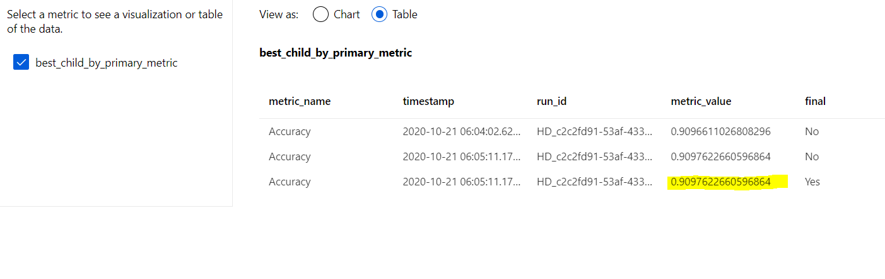
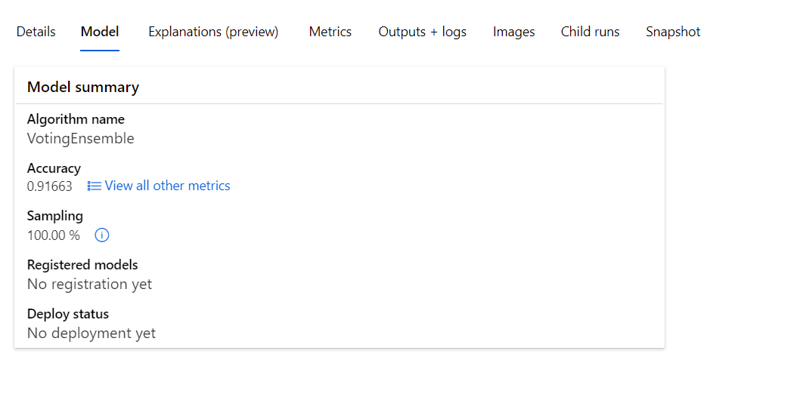

# Optimizing-ML-pipeline-AzureML-UdacityND
# Objective  
This Project aims at making a binary prediction to find whether customers will join a Bank or Not based on the Campaign conducted. 
- Train.py 
- Project.ipynb 
We need to build a Machine learning model using skikit learn and tune the hyper parameters to find the best model using azure ML python SDK and Hyper Drive 
Also we need to  use the Azure auto ML Feature  to find the best model and best Hyperparameters. 
The Best Model seemed to Be Voting Ensemble classifier with XG BOOST as base model from the Auto ML Run summary 
# Entire Project Architecture 
 1 Load the Data from the External Web file and convert into tabular dataset using Azure ML Python SDK  
 2 Perfom the Train test split using SK learn Train test module, here I split my data into 70 % and 30 %  
 3 Apply the Logistic regression using SK learn and choose Accuracy as primary metric  
 4 Tune the Hyper parameters Regularisation rate C and Maximum Iteration using Azure ML Hyper Drive to find the best combination for maximizing the accuracy. 
 5 Next we need  to upload the Datafrom extrenal web to Datastore and feed it to Azure Auto  Ml , compare the Azure Auto Ml performance with Hyper Drive Parameters generated by Hyper Drive.  
# Hyperparameters used
Learning rate with different values . As per literature survey learning rate should not be too long or too small for better model performances. Hence I choose a list of learning rates
using Azure ML python SDK Hyper Drive Parameters. Also in Logistic  regression  C is called inverse regularisation parameter so lesser  C values penalises the model more for better results. 
Maximum iterations is another hyper parameter choosen , maximum iterations is the number of times your model should be trained with the  given hyper parameters. 

# Sampling Method Used 
I have choosen the Random Sampling method  becuase of its advantage of performing equally as Grid Search with lesser compute power requirements. 
# Early Stopping Technique used  
I have Choosen Bandit Policy as the early stopping techniques which uses Slack Factor, Slack Amount, Delay Evaluation, Evaluation Intervals as the parameters.  
Any run that doesn't fall within the slack factor or slack amount of the evaluation metric with respect to the best performing run will be terminated. 
[More Details About the Policy](https://docs.microsoft.com/en-us/python/api/azureml-train-core/azureml.train.hyperdrive.banditpolicy?view=azure-ml-py)
# AutoML Configuration 
Since this is a two class Binary classification I have choosen the task as Classification in Auto M config along with following configurations  number of iterations =20 , maximum number of Concurrent iterations =4, K fold Cross Validations =5. After Running the model with therse configurations Best model choosen was Voting Ensemble with an accuracy of 91%. 
Voting Classifier choose XGBOOST with standard scaler as the base model based on average votings recived compared to other models SGD, Random Forest Classifier , Min Max Scalaer .

# Comparisons between AutoML and Hyper Drive 
After Considering the Primary metric accuracy Auto Ml slightly out performed the regular HyperDrive . Considering the efforts required to run multiple models manually it would be time consuming to do the Data preparation part. Hence AutoML is best as it reduces the efforts of the Engineers so they can concentrate more on other tasks.  In regular Hyper drive only Logistic regression with inverse regularisation parameter C and Maximum iterations as the Hyper Parameters were tested to maximise the accuracy. 
But in Auto ML several Models like XGBOOST, Random Forest Classifier, SGD are ran choosing voting classifier with XGBOOSt as base classifier for voting 

# Future Scope 
This Dataset is hugely Imbalanced , performing more future Engineering technqiues may slightly improve the accuracy. 
# Resources that Helped me during this Project
[Hyper Parameter Tuning Using Azure ML](https://docs.microsoft.com/en-us/azure/machine-learning/how-to-tune-hyperparameters) 
[DataSets and Data Stores Azure ML](https://docs.microsoft.com/en-us/azure/machine-learning/how-to-create-register-datasets) 
[Tabular Datasets using Azure Python SDK](https://docs.microsoft.com/en-us/python/api/azureml-core/azureml.data.dataset_factory.tabulardatasetfactory?view=azure-ml-py) 
[GithUb Repo From Azure ML Python SDK examples](https://github.com/Azure/MachineLearningNotebooks/blob/master/tutorials/create-first-ml-experiment/tutorial-1st-experiment-sdk-train.ipynb)
